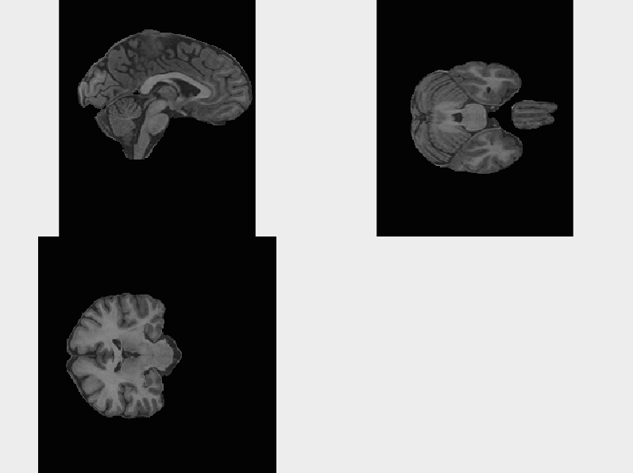
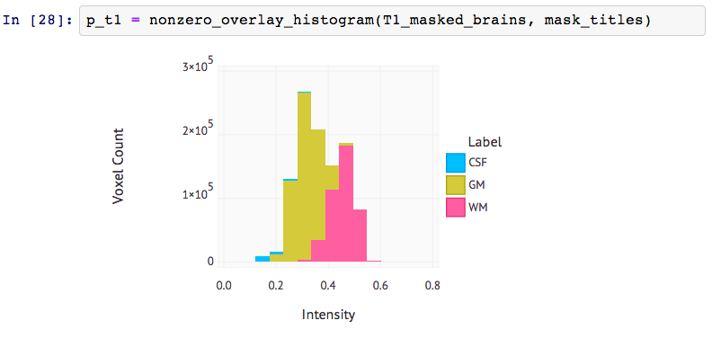
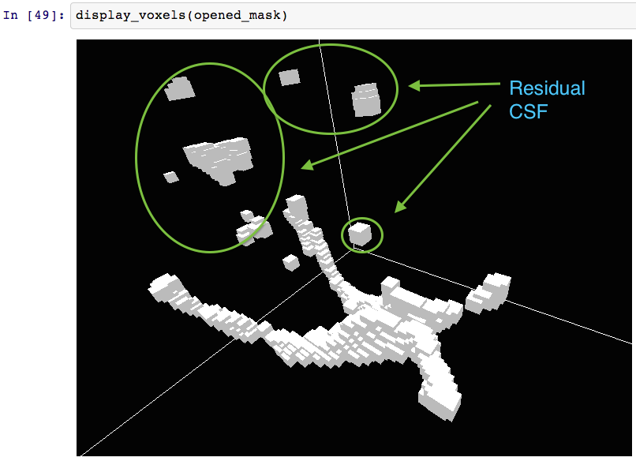
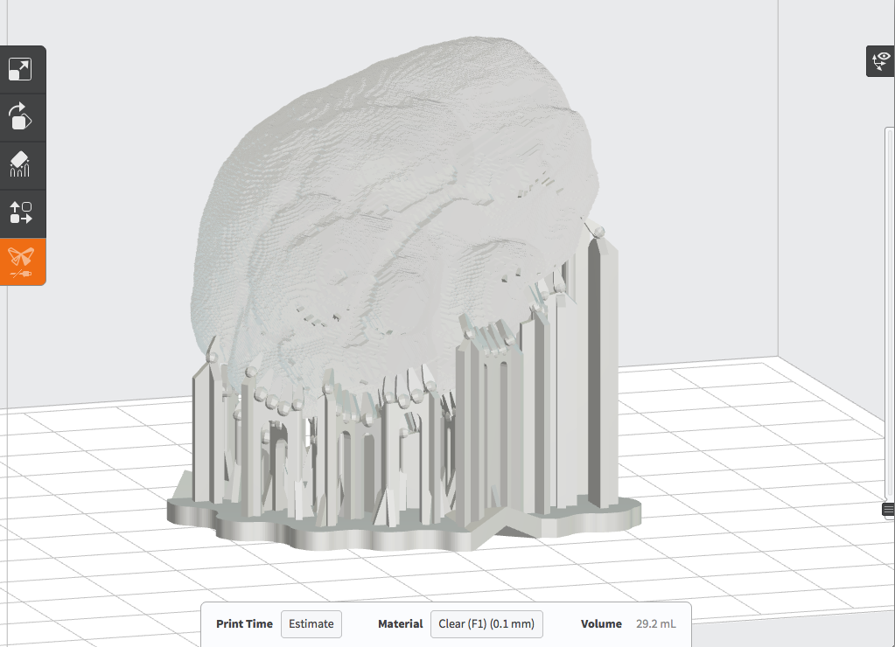
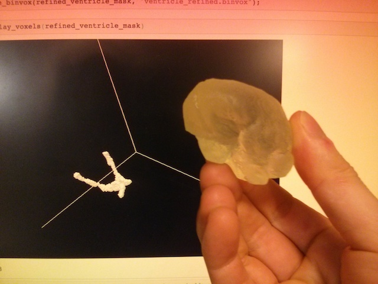

Ethan Sherbondy

6.UAP, Spring 2014

Advised by Prof. Frédo Durand

#Julia for Educational Scientific Computing

[Julia](http://julialang.org/) is a recently-developed dynamic programming language for scientific computing. The project was [started in 2012][1] as an open source, [GPL][2] alternative to MATLAB. It is an attempt to offer a genuinely free language for scientific computing with performance that rivals conventional compiled languages such as C and FORTRAN. [Existing Benchmarks][3] demonstrate that Julia's performance drastically outstrips MATLAB and other open source alternatives such as Octave and NumPy. But the language does not compromise on expressiveness or ease-of-use.

These characteristics make Julia worthy for consideration to be used as a replacement for MATLAB in undergraduate courses offered at MIT. A recently introduced course, 6.S02, currently mandates that students use MATLAB for all 10 of its lab assignments.

6.S02 is a [Medical Technology][4] variant of MIT's introductory Digital Communication Systems course. While 6.S02 gives students hands-on exposure to powerful ideas such as signal processing using Fourier analysis, medical imaging, machine vision, and basic machine learning techniques, the current dependency on MATLAB seems antithetical to the course's implicit aim of empowering students with knowledge. MATLAB is a closed-source, commercial piece of software that [retails for $2150] [5] for non-student users. 

By choosing to use MATLAB as the primary medium of expressing ideas in the classroom, we are actively breeding a dependence on closed-source tools. If, say, a student is curious about how the [Fast Fourier Transform][6] is actually implemented, MATLAB provides no outlet for this curiosity.

The current use of MATLAB is understandable: it is a dependable, familiar tool to the research community. But as the course evolves, it is worthwhile and even imperative to consider the growing landscape of powerful open source alternatives. This investigation focuses on the feasability of using Julia to systematically replace MATLAB in 6.S02.

What follows is an in-depth case study that demonstrates the practicality of porting one of the most computationally intensive assignments from the class: [Machine Vision Lab 1][7] (requires Stellar access). This lab introduces students to tomography, segmentation through histogram analysis, morphological operations, and connected-component analysis.

I hope to convey that all of these operations are already possible to perform in Julia using community-provided open source packages. Surprisingly, considering the language's age, the end result is a computing toolkit which is arguably substantially more robust and extensible.

[The entire source code for my project can be found on Github][8].

#Initial Setup

##Julia Language

[The latest stable Julia release][9] is offered as a precompiled binary for all major platforms (Windows, Mac OS X, and Linux). On all platforms, the total file size is under 50MB to download Julia, compared with the 1GB minimum for a bare-bones MATLAB installation. This makes Julia far more practical for students to install and use on their personal computers.

##Modules

Unlike MATLAB, Julia's libraries do not come preinstalled as a monolithic bundle. But Julia already provides a comprehensive package management tool for installing dependencies. My port of the Machine Vision lab depends on a total of seven [community-provided packages][10], enumerated below:

```
IJulia
NIfTI
Meshes
Images
ImageView
Gadfly
DataFrames
```

This modular approach does not incur any additional overhead for the student. Instructors can trivially install the required modules simply by typing `Pkg.resolve()` from the Julia command prompt, and the package manager will resolve the dependencies, automatically downloading any missing modules from the web.

Because Julia has a comprehensive package management solution, instructors could even prepare their own modules for distribution on the web. Currently, the course instructors distribute the required MATLAB code via Stellar in zip archives. This is a cumbersome setup for a software-intensive course. Whenever a revision is made to one of the instructor's bespoke functions (i.e. in the inevitable event that a bug is discovered), students are forced to manually fetch and unzip the latest version. Julia's package manager, on the other hand, offers students a single, automatic means of grabbing the latest version of an assignemnt with a few keystrokes. And it also offers instructors a means to distribute updates with minimal effort.

##IDE

This is an weak point and an ongoing effort for the Julia project. MATLAB offers a full integrated development environment, complete with an interactive debugger and visual tools for inspecting the variables in the user's current workspace. While multiple conventional desktop offerings exist that provide the majority of an IDE experience, such as [JuliaStudio][11] or [Julietta][12], these tools are still in their infancy.

Nonetheless, Julia offers a powerful default alternative to conventional desktop IDEs in the form of [IJulia][13], a browser-based interactive notebook-style development tool which builds atop the extensive work done on the IPython project. This tool allows students to do interactive development. It provides autocomplete and inline graphics functionality. Plotting can be done entirely through this interface, and interactive versions of these plots can be shared via the web. This means that course instructors can simply send their students a link to further elucidate a concept from lecture or to enhance labs beyond their current, static PDF format. [Here is an example][14] which shows off the rich formatting capabilities of IJulia notebooks, with inline plotting, math, and the likes.

Later parts of the Machine Vision lab depend on the 3D isosurface plotting capabilities of MATLAB so that students can visualize voxel images of their intermediate segmentation results. When I started this project, Julia had no equivalent 3D plotting tool. But because IJulia exists in the Web Browser, I was able to quickly develop a prototype, WebGL-based voxel image viewer. You can see an interactive, online [demonstration of the tool here][15].


This sort of notebook-style development environment encourages students to actively explore and tinker with the underlying algorithms. And the tooling here can only improve over the coming years.

# Machine Vision Lab

A complete notebook of the entire lab code can be found here: [http://nbviewer.ipython.org/github/sherbondy/smallworld/blob/master/Machine%20Vision%201.ipynb](http://nbviewer.ipython.org/github/sherbondy/smallworld/blob/master/Machine%20Vision%201.ipynb)

Our overall goal for the lab is to come up with a simple way to do segmentation to separate out the ventricles in the brain from the rest of the brain anatomy. We rely on the fact that the ventricles are [contiguous regions filled with Cerebrospinal Fluid][16].

We start by defining three utility functions for dealing with [NIfTI][17] volume images. The heavy-lifting of interpretting the file format is done by the [NIfTI.jl][18] package. 

`normalized_niread` takes the raw x,y,z intensity data from a NIfTI file and normalizes it
so that each intensity value is in the range `[0,1]`.

`display_brain_centers` helps the user to get an at-a-glance view of the volume by displaying three images, each a cross-sectional slice from the saggital, coronal, and transverse planes. This takes advantage of Julia's powerful [ImageView.jl][19] package.


After defining our helper functions, we proceed to loading the T1-weighted sample brain image. This is one of three provided volumes (T1, T2, and FLAIR) which correspond to the same brain imaged using [three distinct popular MRI contrast techniques][20].

We then load a volume mask which was created by an expert to separate out the brain from the surrounding skull. We apply this mask to the T1 data to display just the brain:



After masking the brain from the T1 image, we use `nonzero_1d_data` to convert it from a 3D array to a 1-dimensional array with the zero-valued (background) voxels removed. This format allows us to plot a histogram of the distribution of intensity values:


This distribution gives us a quick visual understanding of T1 intensity across the whole brain. From here, we proceed by loading handmade masks which isolate Grey Matter (GM), White Matter (WM), and Cerebrospinal Fluid (CSF).

We then make a histogram which overlays the intensity distribution for each type of brain matter for the T1 image, yielding:



This allows us to compare the differences in intensity distribution by brain matter type.
By defining a helper function, `nonzero_overlay_histogram`, I can trivially create this type of histogram for T2-weighted images and FLAIR images also. This process helps us to identify that T2-weighted images are our best bet for doing segmentation on Cerebrospinal Fluid (and thus the ventricles) by using simple intensity thresholding:


This histogram shows us that Intensity values above 0.6 are almost exclusively CSF in T2 images. This simple cutoff does not exist for CSF in the other two contrasts. They have a large overlap between CSF and the other tissue types across intensity bins.

Plotting the T2 CSF intensity distribution in isolation and looking at the median intensity helps to assure us that thresholding for intensity values above 0.6 will still let us retain the majority of the CSF:


Now that we have a method for isolating CSF based on intensity, we can get an initial rough volume image of the ventricles. The result is very noisy. It includes lots of CSF from the periphary of the brain:


This 3D rendering takes advantage of my interactive browser-based voxel viewer. Since WebGL is a relatively new browser API, I also devised a fallback which depends on the open source desktop application `viewvox` . [Viewvox][21] is an OpenGL voxel viewer. By default, it reads volumes in a custom binary file format called `.binvox`. In order to make the lab work seamlessly with viewvox, I implemented a simple run-length encoder in Julia to convert standard 3D Julia Arrays into binvox files.

In order to remove the surrounding CSF, we take advantage of [morphological operations][22]. These powerful tools help us to eliminate small chunks of CSF from the periphery. A single opening operation, which composes an erode operation with dilation, yields a much cleaner image:



Unfortunately, there are still small bits of external CSF on the periphary of the volume, detached from the ventricles. In order to remove these from the image without resorting to manual techniques, we turn to connected-component analysis.

The idea here is to interpret the binary volume image as a forest of graphs. By traversing the graphs through neighbor pixels, we can identify how many distinct connected regions exist and sort these regions by size. The intuition is that the largest remaining connected regions will probably be the ventricles.

After identifying the connected regions and combining the largest ones into a single volume, we arrive at our final ventricle volume:


For fun, I tried 3D printing a physical model of the brain from the voxel data provided. In order to do this, I used the [marching cubes algorithm][23] in order to conver the voxel image into a triangular mesh. I then exported this mesh as an STL file and used PreForm, the desktop software for the Form1 3D printer, to fabricate the physical model:



This was all possible because Julia has a thriving library ecosystem, so I was able to find an open-source [Meshes package][24] which included an STL exporter and marching tetrahedra implementation.




# Postmortem

Overall, I was very impressed by how well-suited the Julia ecosystem is to the sort of scientific computing introduced in 6.S02. The language and community-provided packages seem like an effective fit for a future iteration of the course. I hope to further extend my voxel viewer to provide better performance and more visual feedback (unit markers and individual-voxel highlighting/selections).

Even if the 6.S02 staff deem Julia to be too immature a language or unreasonable on other grounds, I sincerely hope that they consider reconfiguring the software component of the course to use an open source stack. Octave or Python may be other avenues worthy of future exploration.

# Links
(In order of appearance)

- http://julialang.org/blog/2012/02/why-we-created-julia/ Why We Created Julia
- http://www.gnu.org/copyleft/gpl.html
- http://julialang.org/benchmarks/
- http://www.eecs.mit.edu/academics-admissions/academic-information/subject-updates-st-2013/6s02
- http://www.mathworks.com/pricing-licensing/index.html?intendeduse=comm&prodcode=ML
- https://www.youtube.com/watch?v=1iBLaHGL1AM
- https://stellar.mit.edu/S/course/6/sp14/6.S02/courseMaterial/homework/assignments/assignment24/assignment/1/Machine_Vision_Lab1_6.S02_2014.pdf
- https://github.com/sherbondy/smallworld
- http://julialang.org/downloads/
- http://docs.julialang.org/en/latest/packages/packagelist/
- http://forio.com/products/julia-studio/
- https://github.com/tknopp/Julietta.jl
- https://github.com/JuliaLang/IJulia.jl
- http://nbviewer.ipython.org/url/jdj.mit.edu/~stevenj/IJulia%20Preview.ipynb
- http://nbviewer.ipython.org/github/sherbondy/smallworld/blob/master/Voxel%20Test.ipynb
- http://emedicine.medscape.com/article/1923254-overview
- http://nifti.nimh.nih.gov/
- https://github.com/simonster/NIfTI.jl
- https://github.com/timholy/ImageView.jl
- http://spinwarp.ucsd.edu/neuroweb/Text/br-100.htm
- http://www.cs.princeton.edu/~min/viewvox/
- https://www.cs.auckland.ac.nz/courses/compsci773s1c/lectures/ImageProcessing-html/topic4.htm
- http://paulbourke.net/geometry/polygonise/
- https://github.com/loladiro/Meshes.jl

[1]: http://julialang.org/blog/2012/02/why-we-created-julia/ Why We Created Julia
[2]: http://www.gnu.org/copyleft/gpl.html GPL
[3]: http://julialang.org/benchmarks/ Julia Benchmarks
[4]: http://www.eecs.mit.edu/academics-admissions/academic-information/subject-updates-st-2013/6s02 6.s02 Subject Description 
[5]: http://www.mathworks.com/pricing-licensing/index.html?intendeduse=comm&prodcode=ML MATLAB Pricing
[6]: https://www.youtube.com/watch?v=1iBLaHGL1AM FFT in Julia
[7]: https://stellar.mit.edu/S/course/6/sp14/6.S02/courseMaterial/homework/assignments/assignment24/assignment/1/Machine_Vision_Lab1_6.S02_2014.pdf 6.s02 Machine Vision Lab
[8]: https://github.com/sherbondy/smallworld My Project on GitHub
[9]: http://julialang.org/downloads/ Julia Download Page
[10]: http://docs.julialang.org/en/latest/packages/packagelist/ Julia Package Repository
[11]: http://forio.com/products/julia-studio/ JuliaStudio
[12]: https://github.com/tknopp/Julietta.jl Julietta IDE
[13]: https://github.com/JuliaLang/IJulia.jl IJulia
[14]: http://nbviewer.ipython.org/url/jdj.mit.edu/~stevenj/IJulia%20Preview.ipynb IJulia Notebook Example
[15]: http://nbviewer.ipython.org/github/sherbondy/smallworld/blob/master/Voxel%20Test.ipynb WebGL Voxel Viewer Example
[16]: http://emedicine.medscape.com/article/1923254-overview Ventricles of the Brain
[17]: http://nifti.nimh.nih.gov/ NIfTI File Format
[18]: https://github.com/simonster/NIfTI.jl Julia NIfTI Package
[19]: https://github.com/timholy/ImageView.jl Julia ImageView Package
[20]: http://spinwarp.ucsd.edu/neuroweb/Text/br-100.htm BASIC PRINCIPLES OF MR IMAGING
[21]: http://www.cs.princeton.edu/~min/viewvox/ viewvox: 3D voxel model viewer
[22]: https://www.cs.auckland.ac.nz/courses/compsci773s1c/lectures/ImageProcessing-html/topic4.htm Morphological Image Processing
[23]: http://paulbourke.net/geometry/polygonise/ Polygonising a scalar field
[24]: https://github.com/loladiro/Meshes.jl Julia Meshes Package